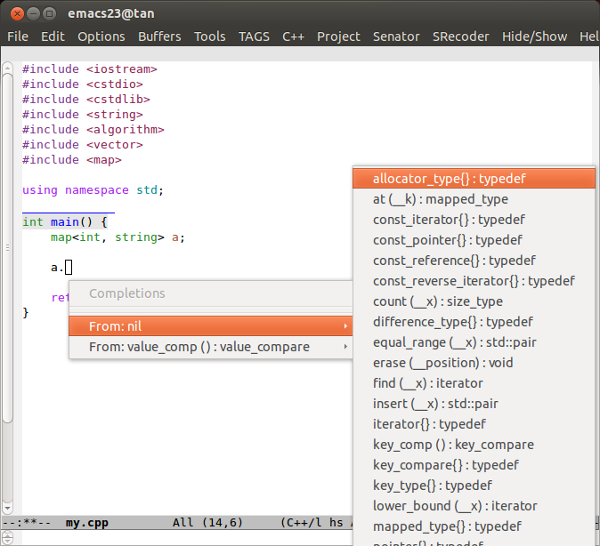

新增更新
----------------------------
2013.08.18
> 1.取消auto-complete模式（只是注释了配置，取消注释即可开启)

2013.08.17
> 1.新增auto-complete模式  
> 2.解决ac 与 yas冲突问题  
2013.08.14
> 1.增强补全功能  
> 2.新增company-mode补全  

2013.08.08
> 1.默认启动line-mode  

2013.08.04
> 1.默认启动最大化  

2013.08.03
> 1.新增markdown-mode  

2013.7.31
> 1.更改默认主题  
> 2.增加快速字体缩放(按住CTRL+滑轮)  
> 3.新增w3m浏览网页  
> 4.stardict 查词  

常见问题
--------------------------------------
1. 说明如果出现不能打开w3m-load，要安装w3m, 具体操作如下:  
> 安装 w3m-el-snapshot  
>> sudo apt-get install w3m-el-snapshot  
>
安装emacs-w3m(要保证在~/目录下操作)  
>> cvs -d :pserver:anonymous@cvs.namazu.org:/storage/cvsroot login  
>> 提示输入密码, 密码为空  
>> cvs -d :pserver:anonymous@cvs.namazu.org:/storage/cvsroot co emacs-w3m  
>> cd emacs-w3m  
>> autoconf  
>> ./configure  
>> sudo make  
>> sudo make install  

2. emacs提示 /bin/bash: sdcv: 未找到命令，说明未安装stardict 和 sdcv  
> sudo apt-get install stardict （自己加词库）  
> sudo apt-get install sdcv  

3. /bin/bash: markdown: 未找到命令  
> sudo apt-get install markdown  

4. company-mode不能启用  
> 请M-x company-mode)

##新增的company补全(2013.08.14)

##边看题边敲代码（ACM）
图：  

c/c++插件
---------------------------------------------------------
cedet是根据 http://emacser.com/cedet.htm 设置的。  
一起那用 auto-complete + clang 感觉好卡，就全卸了，用的 CVS 版的 edet.  
edet的安装 http://emcser.com/install-cedet.htm  

##针对补全的2个截图
图一：

图二：

##安装方法
		安装好 emacs 然后将代码仓库的
		.emacs.d/ 放在～/
		.emacs 放在 ~/
		安装好 g++ 便可以直接使用了。

使用技巧
------------------
##补全
		1.M-n 弹出补全菜单（C-n C-p 可以上下选择)
##跳转
		1.F12 跳到函数定义
		2.M-S-F12 跳到函数声明去，在声明处再执行的话就会再跳回函数
		3.S-F12 跳会初始位置
